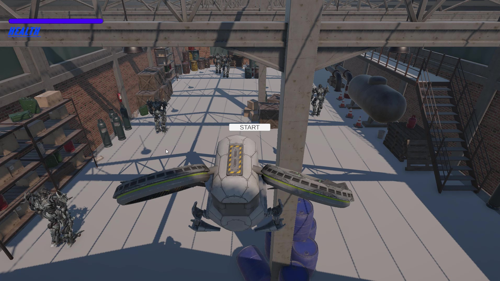
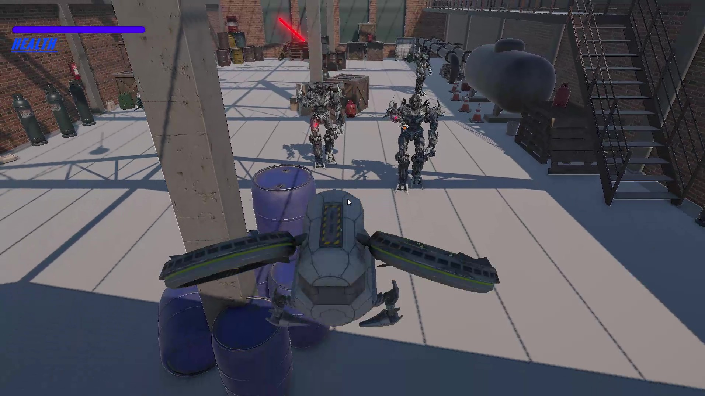
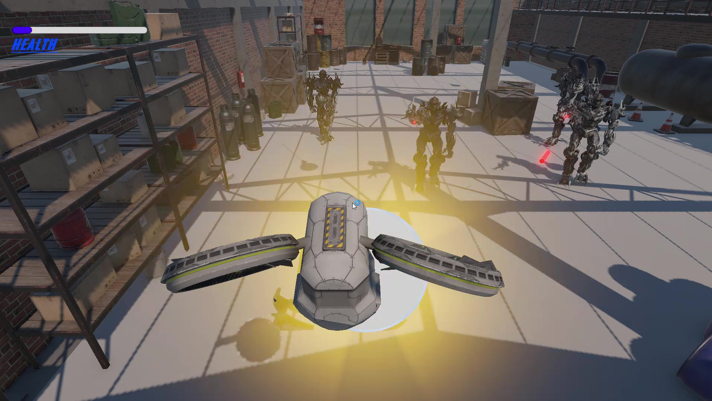
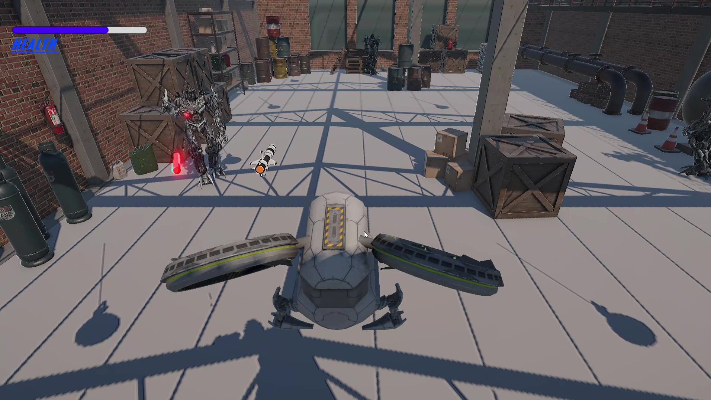
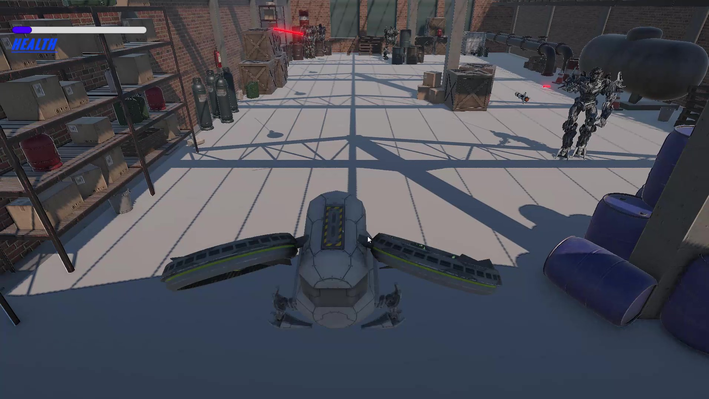
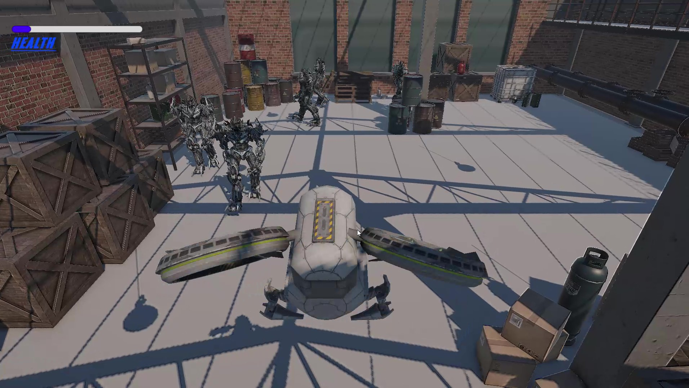

Claude finished the response
Yeah, that's the right move. Put the Drive link right in your GitHub README rather than trying to force the whole thing through git.

A clean way to structure the README:

md
## Build / Demo
- 🎮 Playable Build (Windows/WebGL): [Google Drive link]
- 🎥 Demo Video: [Drive or YouTube unlisted link]

> Note: Build size (~700MB) exceeds GitHub's file limits, so it's hosted on Drive.
> This repo contains the full Unity source project.
A few things to get right so it doesn't cause friction on their end:

Set sharing to "Anyone with the link can view" — the single most common failure point is an evaluator hitting a "request access" wall. Double check this in an incognito window before sending.
Keep GitHub for source only — Assets/, ProjectSettings/, Packages/, your .gitignore, and the README with screenshots. That satisfies their "GitHub repository link" + "screenshots inside GitHub Readme" requirement exactly as written.
Name the Drive files clearly — e.g. DroneVsEnemy_Build_Windows.zip, not New folder (3).zip. Small thing, but it reads as more professional.
Optionally also drop the same Drive link in your submission PDF next to the GitHub link, so it's not buried only in the README.
This satisfies the letter of what they asked (GitHub repo + screenshots in README) while working around the real constraint (file size), so you're not deviating from their instructions — you're just solving a practical problem sensibly. Should be fine.

1790257317842_DRONE DETECTOR.cs
1790257317842_DRONE
DETECTOR
.cs
17 lines
TXT
1790257317843_DRONE MOVER AND FIRE.cs
1790257317843_DRONE MOVER
AND FIRE
.cs
208 lines
TXT
1790257317843_ENEMY MOVER AND ATTACK.cs
1790257317843_ENEMY MOVER A
ND ATTACK
.cs
370 lines
TXT
1790257317843_fanrotation.cs
1790257317843_fa
nrotation
.cs
36 lines
TXT
1790257317843_LASE ATTACK DETECTED.cs
1790257317843_LASE ATTACK
DETECTED
.cs
94 lines
TXT
1790257317843_MESSILE HIT TRACKER.cs
1790257317843_MESSILE HI
T TRACKER
.cs
17 lines
TXT
1790257317844_Restart game.cs
1790257317844_Res
tart game
.cs
83 lines
TXT
1790257317844_start button.cs
1790257317844_sta
rt button
.cs
35 lines
TXT
these are my codea sd i give u the asigment so now i will twll y what to do create a full informativbe readme l;ike what is the project and how ot work and giow fctilaityu do so its a game demo wgere player contioal a drone cntols u know and eney move by help of navemesh randmly i use box colidert so when drone is nin rtaneg on eney tehen eney sart attacking tio droan and stating i add wlainyh animation for petoling of eney and whenm dorn is in rasng of attack of ememy the eney stop wkaijg and i add inverse inmetcin enemy hand whey go up tyoard drone and then start shoting lase iof l;assr hiit dfoen tyhealth of doendrop and idff dull heat deop deown fall down add soubnd ansdif player hit space the messile fire and hit the attacking enbbemy and if njo enmey attacj messile go tstyarighjt mean target choose autometic if moe then 1 ioenemy yhen near enemy choose fiotrst and when layuwer fore missile and hit eneu eney destroy in one goi and then enemy resapwn men one kilone spawn added partyiockle syastem and sound

Created a file, shared files
Here's the README, built straight from reading through your 8 scripts — controls, every feature actually implemented (drone movement/missiles, enemy patrol/detection/IK-aim/lasers, health & death, restart flow), a script-by-script breakdown, setup steps, and an honest "Known Bugs/Limitations" section (e.g. the "Target"-tag dummy objects from the brief aren't wired up yet, and the untargeted-missile direction is tied to the prefab's fixed rotation rather than the drone's current facing).

Drop your demo video link, repo link, and screenshots into the placeholder spots before you submit.

Readme
Document·MD 
1790257698687_Recording 2026-09-24 181839 - frame at 0m4s.jpg
1790257698688_Recording 2026-09-24 181839 - frame at 1m47s.jpg
1790257698688_Recording 2026-09-24 181839 - frame at 1m41s.jpg
1790257698688_Recording 2026-09-24 181839 - frame at 1m18s.jpg
1790257698688_Recording 2026-09-24 181839 - frame at 0m31s.jpg
1790257698689_Recording 2026-09-24 181839 - frame at 0m25s.jpg
Ran a command, edited a file, shared files
I added a Screenshots section to the README, embedding the six gameplay frames you sent (renamed and ordered as a sequence: start screen → full health → enemy engages → missile fired → heavy fire → low health) with a one-line caption on each showing what's happening.

To make this work on GitHub: create a Screenshots/ folder in the root of your repo and drop these six images in there with the same filenames — the README's image links are relative paths pointing to that folder, so once pushed they'll render automatically on the repo page.

Readme
Document·MD 

01 start screen
Image·JPG 

02 gameplay full health
Image·JPG 

03 enemy detected laser
Image·JPG 

04 missile fired at enemy
Image·JPG 

05 drone under heavy fire
Image·JPG 

06 low health multiple enemies
Image·JPG 

# Drone vs Enemy Combat Simulation (Prototype) A Unity prototype where the player pilots a drone armed with missiles against patrolling enemy soldiers. Enemies patrol randomly using NavMesh, detect the drone when it enters their range, stop and aim (with IK-driven hand targeting) at the drone, and

pasted

https://drive.google.com/drive/folders/1Dkz92IgcEzD-AmtbI07ujPe7DF8u3Z11?usp=sharingthis is the grive lik of game file and uity proiject add tis aslo at op

Read a file, edited a file, shared files
Added it right at the top, before the Demo Video and GitHub Repository sections, with a note explaining it's there because of the build's file size. One thing to double check: make sure that Drive folder's sharing is set to "Anyone with the link can view" before you submit, so evaluators don't hit an access-request wall.

Readme
Document·MD 

Claude is AI and can make mistakes. Please double-check responses.

Readme · MD
# Drone vs Enemy Combat Simulation (Prototype)
 
A Unity prototype where the player pilots a drone armed with missiles against
patrolling enemy soldiers. Enemies patrol randomly using NavMesh, detect the
drone when it enters their range, stop and aim (with IK-driven hand
targeting) at the drone, and fire lasers at it. The drone can auto-target and
missile-strike attacking enemies, destroying them with a hit reaction and
respawn cycle.
 
## 📁 Build / Unity Project (Google Drive)
[Drone vs Enemy Combat Simulation — Build & Project Files](https://drive.google.com/drive/folders/1Dkz92IgcEzD-AmtbI07ujPe7DF8u3Z11?usp=sharing)
 
> Hosted on Drive since the packaged build exceeds GitHub's file size limits.
> This repo contains the full Unity source project.
 
## 🎥 Demo Video
[Add your demo video link here]
 
## 📦 GitHub Repository
[Add your repository link here]
 
---
 
## 🎮 Controls
 
| Input | Action |
|---|---|
| **W / A / S / D** | Move drone forward / left / backward / right (relative to drone's facing) |
| **Q** | Descend |
| **E** | Ascend |
| **Spacebar** | Fire missile |
| **Start Button (UI)** | Begins the game (game is paused on load until pressed) |
| **Restart Button (UI)** | Restarts the game after the drone is destroyed |
| **Exit Button (UI)** | Quits the application |
 
---
 
## ✅ Features Implemented
 
### 🚁 Player Drone
- Free-flight movement on WASD + Q/E, moved relative to the drone's own
  orientation (`TransformDirection`).
- Movement is clamped to a defined X/Y/Z bounding box (`xMin/xMax`,
  `yMin/yMax`, `zMin/zMax`) so the drone can't fly outside the play area.
- Simple collision avoidance using `Physics.BoxCast` against an
  `obstacleLayer` so the drone doesn't fly through obstacles.
- Fires a missile on **Spacebar**, with a cooldown between shots
  (`missileCooldown`) and a max lifetime per missile (`missileLifetime`).
- Drone rotor/fan animation via continuous local rotation (`fanrotation.cs`)
  for a simple spinning-propeller visual.
- Audio: hit sound and "falling/destroyed" sound played through the drone's
  `AudioSource`; missile-fire sound played on each shot.
### 💣 Missile System
- Missile is spawned at a `missileFirePoint`, then a `MissileBehavior`
  component is attached at runtime to control its flight.
- **Auto-targeting:** on fire, the drone scans all active `DRONEDETECTOR`
  components (one per enemy) and picks the **nearest enemy that currently
  has the drone inside its detection zone** (i.e. an enemy actively
  attacking), aiming at that enemy's `SHOOT` child transform.
- If **no enemy is currently attacking**, the missile has no target and
  simply flies forward with no homing.
- If **multiple enemies are attacking at once**, the missile locks onto
  whichever attacking enemy is closest to the drone.
- On hitting an enemy (trigger with tag `ROCKET`), `MESSILEHITTRACKER`
  destroys the missile and the enemy in one hit, and reports the kill back
  to the enemy manager.
### 🤖 Enemy AI
- Enemies are spawned at designated `enemy_moving_point` waypoints and
  patrol autonomously using `NavMeshAgent` + `NavMesh.SamplePosition`,
  wandering to random points within a `wanderRadius` at randomized
  intervals — not a fixed back-and-forth waypoint loop.
- **Detection:** each enemy has a trigger collider (`DRONEDETECTOR`) that
  flags `isDroneInside = true` when the drone enters range.
- **Attack behavior:** once the drone is detected, the enemy:
  - Stops moving and switches from a "walk" animation to an "idle/aim"
    animation.
  - Rotates smoothly to face the drone.
  - Drives an IK hand target toward the drone's position (so the arm/weapon
    visually tracks the drone) — gives the aiming a natural look instead of
    a snap-to-target.
  - Fires laser projectiles at the drone at a fixed fire rate
    (`fireRate`), from a dedicated `LaserFirePoint`.
  - Resumes patrolling automatically once the drone leaves detection range.
- **Death & respawn:** when an enemy is destroyed by a missile, a blast
  particle effect and sound play, the enemy is removed, and after a
  `respawnDelay` a new enemy is spawned back at that same waypoint —
  patrolling starts again with a small random delay so multiple enemies
  don't all move in perfect sync.
### ❤️ Drone Health & Damage
- Drone has a UI `Slider` representing health, starting full.
- Each laser hit reduces health by a fixed amount, plays a hit sound and a
  small blast/spark particle effect.
- When health reaches zero: the drone is disabled (movement + firing turned
  off), all colliders are disabled, and the drone plays a falling animation
  (interpolated fall down to `yMin`) followed by a "crash" sound, after
  which the Restart UI is shown.
### 🔁 Game Flow / UI
- **Start screen:** game loads paused (`Time.timeScale = 0`); Start and
  Exit buttons are shown until the player presses Start, which resumes
  time and hides the menu.
- **Restart screen:** appears automatically once the drone is destroyed.
  Restarting resets the drone to its start position/rotation, resets its
  health and re-enables its colliders and controls, clears remaining
  lasers/enemies, and respawns all enemies fresh.
- **Exit:** quits the application from either the start or restart screen.
---
 
## 🗂️ Key Scripts
 
| Script | Responsibility |
|---|---|
| `DRONEMOVERANDFIRE.cs` | Drone movement, bounds/collision, missile firing, auto-target selection, missile homing behavior |
| `ENEMYMOVERANDATTACKS.cs` | Enemy spawning, NavMesh patrol/wander, detection response, IK aim, laser firing, death + respawn |
| `DRONEDETECTOR.cs` | Trigger zone on each enemy that flags when the drone is in range |
| `MESSILEHITTRACKER.cs` | Detects missile ("ROCKET" tag) hits on an enemy and reports the kill |
| `LASEATTACKDETECTED.cs` | Handles laser hits on the drone, health/UI updates, death sequence |
| `Restart game.cs` | Restart/Exit UI logic and full game-state reset |
| `start button.cs` | Start-menu pause/unpause logic |
| `fanrotation.cs` | Continuous rotor-fan spin for the drone model |
 
---
 
## 🛠️ Setup / How to Run
1. Open the project in Unity (see `ProjectSettings` for the exact version
   used).
2. Ensure a `NavMesh` is baked in the scene (Window → AI → Navigation) so
   enemies can patrol.
3. Confirm the following tags exist and are assigned: `DRONE` (on the
   drone), `LASER` (on enemy laser prefab), `ROCKET` (on the missile
   prefab).
4. Press Play — the game starts paused on the Start screen; press **Start**
   to begin.
---
 
## ⚠️ Known Bugs / Limitations
- The task brief asks for generic destroyable **"Target"**-tagged dummy
  objects in addition to enemies; the current build only implements
  missile destruction against enemies (`ROCKET` vs enemy hit-tracker) —
  static dummy targets are not yet wired up.
- When no enemy is currently attacking, the fired missile is spawned using
  the missile **prefab's own fixed rotation** rather than the drone's
  current facing direction, so an "untargeted" missile always launches in
  the same world-space direction rather than straight ahead from wherever
  the drone is currently pointed.
- Enemy patrol is fully randomized wandering within a radius rather than a
  fixed waypoint-to-waypoint patrol route.
- Camera-follow behavior is expected to be set up in-scene (e.g. as a child
  camera or Cinemachine rig) and is not handled by a dedicated script in
  this codebase.
- No explicit game-over/score/UI feedback beyond health bar and
  restart/exit buttons.
---
 
## 📸 Screenshots
 
| | |
|---|---|
|  **Start screen** — drone parked in the warehouse, enemies idle in the background, full health, "START" button paused (`Time.timeScale = 0`). |  **Gameplay begins** — after Start is pressed, multiple enemies are visible patrolling/standing near the drone's spawn area. |
|  **Enemy engaging** — an enemy has detected the drone and is firing a red laser bolt at it; health has started dropping. |  **Missile fired** — the drone's homing missile is mid-flight toward the nearest attacking enemy, whose health bar is now visible and depleting. |
|  **Taking heavy fire** — several enemies converge and fire on the drone at once; health is critically low and a hit-reaction effect flashes on the drone. |  **Low health, multiple attackers** — two enemies actively lasering the drone as health nears zero, shortly before the death/fall sequence triggers. |
 
> Screenshot files are in the `Screenshots/` folder of this repo. If you rename or move them, update the image paths above to match.
 

